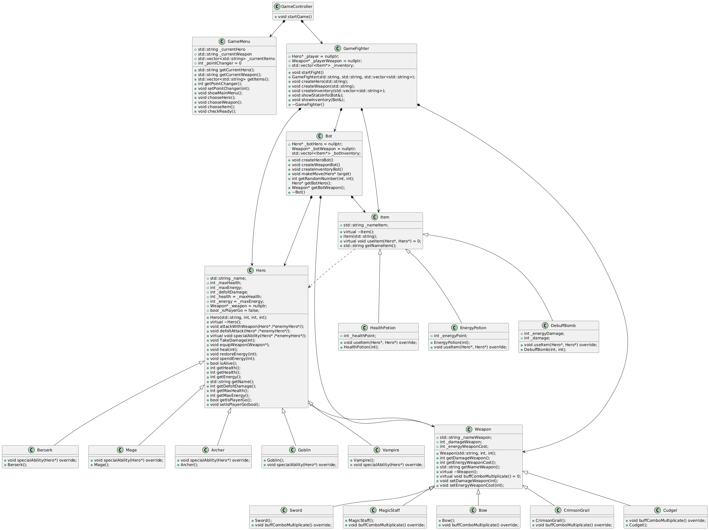

# Class Diagram

## Diagram

## Description

### Classes:
1. **GameController**: Manages the overall game flow. Creates and owns `GameMenu` and `GameFighter`.
2. **GameMenu**: Handles user interaction in the main menu.
3. **GameFighter**: Manages the battle logic. Creates and owns `Bot`, `Hero`, `Weapon`, and `Item`.
4. **Bot**: Represents the AI opponent. Creates and owns `Hero`, `Weapon`, and `Item`.
5. **Hero**: Base class for all heroes.
6. **Berserk**, **Mage**, **Archer**, **Goblin**, **Vampire**: Player and bot heroes, inheriting from `Hero`. Each overrides `specialAbility`.
7. **Weapon**: Base class for all weapons.
8. **Sword**, **MagicStaff**, **Bow**, **CrimsonGrail**, **Cudgel**: Player and bot weapons, inheriting from `Weapon`.
9. **Item**: Base class for items.
10. **HealthPotion**, **EnergyPotion**, **DebuffBomb**: Items, inheriting from `Item`. Each overrides `useItem`.

### Relationships:
- **Composition**:
  - `GameController` owns `GameMenu` and `GameFighter`.
  - `GameFighter` owns `Bot`, `Hero`, `Weapon`, and `Item`.
  - `Bot` owns `Hero`, `Weapon`, and `Item`.
- **Association**:
  - `Hero` uses `Weapon`.
- **Dependency**:
  - `Item` depends on `Hero` (passed as a parameter in `useItem`).
- **Inheritance**:
  - All heroes inherit from `Hero`.
  - All weapons inherit from `Weapon`.
  - All items inherit from `Item`.