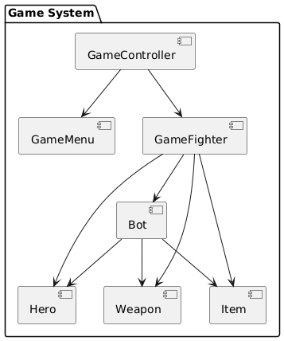

/*Maksim Lazarev st128707@student.spbu.ru
second LabWork*/

# Component Diagram

## Diagram

## Description

### Components:
1. **GameController**: Manages the overall game flow.
2. **GameMenu**: Handles user interaction in the main menu.
3. **GameFighter**: Manages the battle logic.
4. **Hero**: Base class for all heroes.
5. **Weapon**: Base class for all weapons.
6. **Item**: Represents consumable items.
7. **Bot**: Represents the AI opponent.

### Interactions:
- `GameController` coordinates between `GameMenu` and `GameFighter`.
- `GameFighter` uses `Hero`, `Weapon`, and `Item` for the player's battle logic.
- `Bot` creates its own heroes, weapons, and items to fight the player.