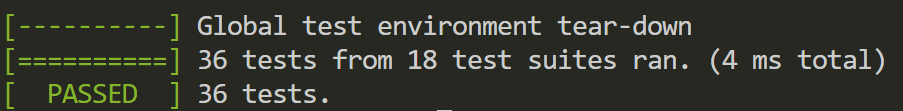
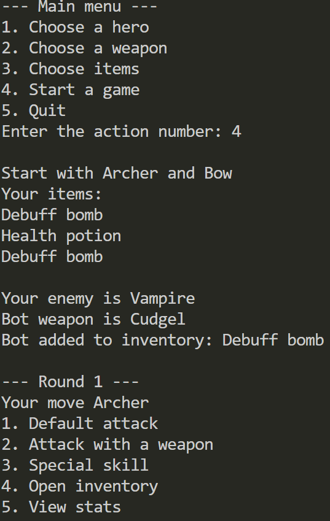
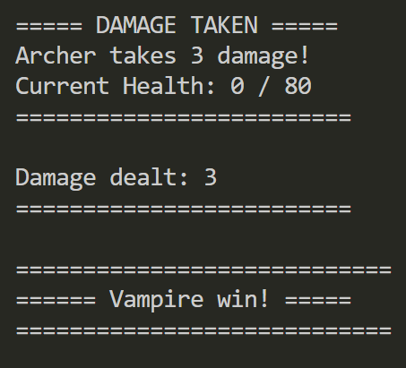
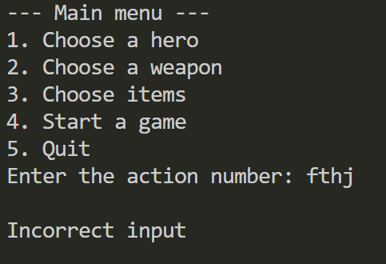
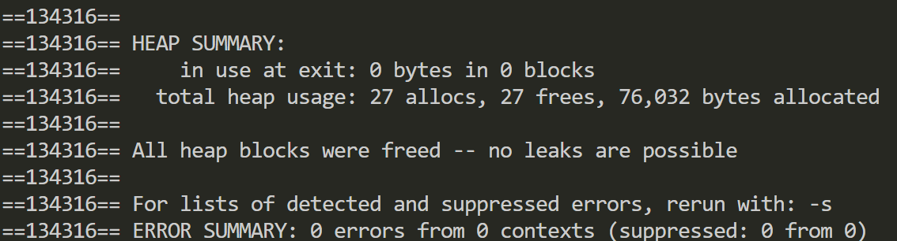

/*Maksim Lazarev st128707@student.spbu.ru
second LabWork*/

# Test report

## Unit Testing

#### Unit tests were added for classes: Weapon, Hero, Bot, Item, GameMenu.

## System Testing

#### The game transitions correctly from the main menu to battle

#### When a hero dies, the winner is displayed correctly

#### If the user enters something incomprehensible, an invalid input is displayed

## Memory Testing with Valgrind

#### No memory leaks and other memory related errors

